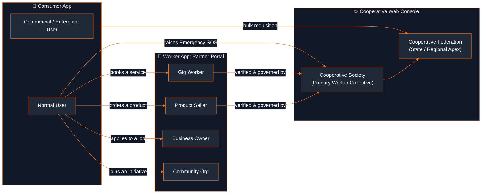
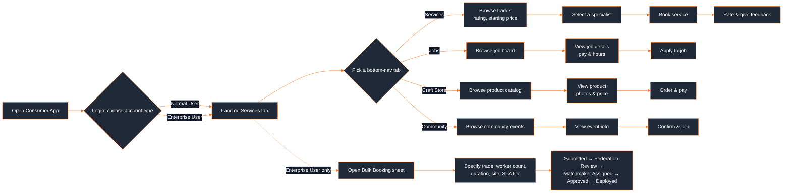
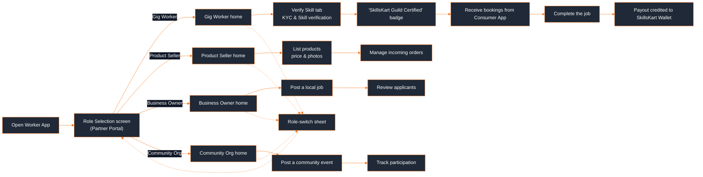
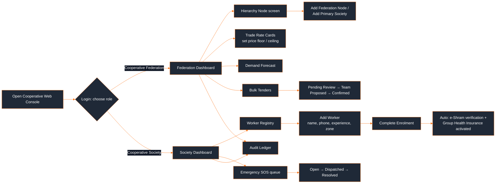
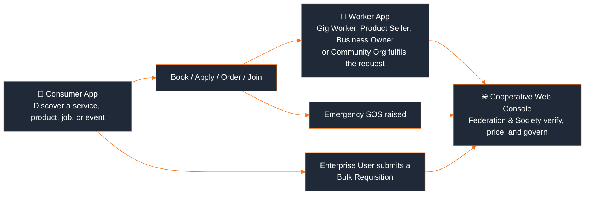

<div align="center">

# 🛠️ SkillsKart

### Your Skill. Your Shop. Your Say.

A cooperative-owned digital marketplace connecting **consumers** with verified **gig workers, artisans, businesses, and community organizations**, governed end-to-end by India's Labour Cooperative Federations and Societies.

Built for **SIH26089: Cooperative Gig Services Platform for Household & Community Services**

<br/>


<br/>

**Jump straight to an app**, presented in the order a real user meets them: **consumer → worker → cooperative**

[](#-consumer-app)
[](#-worker-app)
[](#-website-cooperative-web-console)

</div>

---

## 📚 Table of Contents

- [What is SkillsKart?](#-what-is-skillskart)
- [Problem We Solve](#-problem-we-solve)
- [Our Solution](#-our-solution)
- [SkillsKart Ecosystem](#-skillskart-ecosystem)
- [User Roles](#-user-roles)
- [📱 Consumer App](#-consumer-app)
- [👷 Worker App](#-worker-app)
- [🌐 Website: Cooperative Web Console](#-website-cooperative-web-console)
- [Flow Diagrams](#-flow-diagrams)
  - [Consumer Flow](#-consumer-flow)
  - [Worker Flow](#-worker-flow)
  - [Cooperative Flow](#-cooperative-flow)
  - [How the three flows connect](#-how-the-three-flows-connect)
- [System Architecture](#-system-architecture)
- [Tech Stack](#-tech-stack)
- [Project Structure](#-project-structure)
- [Getting Started](#-getting-started)
- [Environment Variables](#-environment-variables)
- [Running the Project](#-running-the-project)
- [Testing](#-testing)
- [Security](#-security)
- [Future Scope](#-future-scope)
- [Contribution](#-contribution)
- [License](#-license)
- [Team](#-team)

---

## 🌟 What is SkillsKart?

Millions of skilled workers in India (electricians, plumbers, carpenters, painters, domestic helpers, caregivers, drivers, gardeners, cleaners, and technicians) work in the informal economy with no verified digital identity, no fair-wage guarantees, and no organized route to steady demand. Consumers, meanwhile, have no reliable way to find and trust these workers.

SkillsKart closes that gap with a **consumer-facing marketplace** on one side, a **worker/partner app** on the other, and **Labour Cooperative Federations and Societies** (not a single private aggregator) governing verification, pricing, and welfare in between.

## 🎯 Problem We Solve

- Consumers have no easy way to **discover and book** verified local service providers, hand-made products, part-time jobs, or community initiatives in one place.
- Skilled workers lack a **verified, portable digital profile** that proves their trade and credibility.
- There is no structured system for **fair, transparent pricing**: wages are often set unilaterally by demand-side platforms.
- Worker welfare schemes (insurance, social security) exist on paper but are **disconnected from where workers actually get discovered and hired**.
- Cooperative federations and societies, the real-world bodies meant to protect workers, have **no digital tooling** to onboard, verify, and govern their members at scale.

## 💡 Our Solution

SkillsKart is split into three purpose-built applications, presented here in the order a real user actually travels through the ecosystem:

| # | App | Built for | Role |
|---|---|---|---|
| 1 | **📱 Consumer App** | Households, businesses | Discover and book services, browse jobs, shop artisan products, and take part in community programs |
| 2 | **👷 Worker App** | Gig workers, product sellers, business owners, community organizations | A single "Partner Portal" where each of these four roles gets a dedicated workspace |
| 3 | **🌐 Cooperative Web Console** | Cooperative Federations & Societies | Govern the network: approve members, set rate cards, monitor demand, and respond to emergencies |

---

## 🏗️ SkillsKart Ecosystem

<div style="width: 100%; overflow-x: auto; -webkit-overflow-scrolling: touch;">



</div>

> **Reading note:** this diagram, and the rest of this README, follows the **consumer's journey first**. In the real onboarding sequence, a worker must already be verified by a Cooperative Society before a consumer ever sees them; the Cooperative Web Console is what makes that verification possible behind the scenes.

## 👥 User Roles

### 🧑‍💼 Consumer
Two account types, chosen at login:
- **Normal User**: books individual services, applies to jobs, shops artisan products, and joins community initiatives.
- **Commercial / Enterprise User**: everything a Normal User can do, plus **bulk service requisitions**: submitting multi-worker, multi-month contract requests (trade, headcount, duration, site, SLA tier) that are routed to a Cooperative Federation for review and worker deployment.

### 👷 Worker
Four workspaces, chosen at role selection in the Worker App:
- **Gig Worker**: verifies their trade skill, gets listed under a Cooperative Society, and receives local service bookings through the Consumer App.
- **Product Seller**: lists hand-crafted/artisan products with photos and pricing for consumers to browse and order through the Consumer App's Craft Store.
- **Business Owner**: posts local, part-time job openings that Normal Users can browse and apply to from the Consumer App's Jobs tab.
- **Community Organization**: posts community initiatives, such as blood donation camps and health drives, that consumers can discover and join through the Community Services section.

---

## 📱 Consumer App

*Flutter app · role-based login (Normal / Enterprise) · 4-tab bottom navigation*

**Flow:** `Login (choose account type)` → `Services / Jobs / Craft Store / Community (bottom nav)` → `Explore & Select` → `Book / Apply / Order / Join`

| Tab | What it offers |
|---|---|
| **Services** | Browse trades (electricians, plumbers, carpenters, painters, domestic helpers, caregivers, drivers, gardeners, cleaners) with ratings, starting prices, and guild-certified specialists to select and book |
| **Jobs** | Browse and apply to part-time/local jobs posted by Business Owners |
| **Craft Store** | Browse and order hand-crafted products listed by Product Sellers |
| **Community Services** | Discover and join community drives (e.g. blood donation camps) posted by Community Organizations |

**Enterprise-only flow: Bulk Booking**

Commercial Users get an additional **Bulk Booking** sheet where they specify trade, worker count, contract duration, shift, site location, and SLA tier. The request is tracked through a federation-review lifecycle:

`Submitted → Federation Review → Matchmaker Assigned → Approved → Deployed`

## 👷 Worker App

*Flutter app · "Partner Portal" · single role-selection screen routes to one of four dedicated workspaces*

On launch, the Worker App presents a role picker. There is no separate login for each role; a partner simply selects their workspace:

1. **Gig Worker**: verify skills, view bookings received from consumers
2. **Product Seller**: list products with price and photos, manage orders
3. **Business Owner**: post local job openings for consumers to apply to
4. **Community Organization**: post community events (health camps, drives, etc.)

Each of the four roles opens into its own dedicated main screen with a role-appropriate bottom navigation, and a role-switch sheet lets a partner jump between workspaces without a full re-login.

## 🌐 Website: Cooperative Web Console

*React + TypeScript + Vite + Tailwind CSS single-page app*

The website is **not a public marketing site**: it is the operational console used by **Cooperative Federations and Societies** to govern the network. Login offers two role types, **Cooperative Federation** (state/regional apex) and **Cooperative Society** (primary worker collective), each with a one-click demo account for instant access.

| Screen | Purpose |
|---|---|
| **Dashboard** | Network-wide overview for the logged-in federation/society |
| **Hierarchy Node** | View the federation → society → worker organizational structure |
| **Worker Registry** | Directory of verified, onboarded workers under this node |
| **Emergency SOS** | Live queue of SOS alerts raised from the Consumer App, routed here for dispatch |
| **Trade Rate Cards** | Set and cap service pricing (floor/ceiling) per trade |
| **Demand Forecast** | View projected demand and workforce allocation by area/trade |
| **Bulk Tenders** | Review and action enterprise bulk-service requisitions |
| **Audit Ledger** | Governance/audit trail of administrative actions |
| **Admin Profile** | Manage the logged-in administrator's account |

---

## 🔄 Flow Diagrams

Three detailed flows, one per app, in the same consumer → worker → cooperative order as the rest of this README, followed by how they connect end to end.

### 📱 Consumer Flow

<div style="width: 100%; overflow-x: auto; -webkit-overflow-scrolling: touch;">



</div>

### 👷 Worker Flow

<div style="width: 100%; overflow-x: auto; -webkit-overflow-scrolling: touch;">



</div>

### 🌐 Cooperative Flow

<div style="width: 100%; overflow-x: auto; -webkit-overflow-scrolling: touch;">



</div>

> Enrolling a worker on the Society Dashboard is wired to automatically generate a cooperative member identity and activate their e-Shram and Group Health Insurance status. This is implemented as mock state (`AppContext`), not a live integration with government portals.

### 🔗 How the three flows connect

<div style="width: 100%; overflow-x: auto; -webkit-overflow-scrolling: touch;">



</div>

- **Emergency SOS:** when a consumer raises an SOS from the Consumer App, it is designed to surface directly in the Cooperative Web Console's Emergency SOS queue (`Open → Dispatched → Resolved`) so the responsible society/federation can dispatch a worker quickly.
- **Bulk requests:** enterprise/commercial consumers needing multiple workers (e.g. for a construction site or institution) submit a requisition that a Cooperative Federation reviews and approves for deployment. Note the Consumer App's own status labels (`Submitted → Federation Review → Matchmaker Assigned → Approved → Deployed`) and the Web Console's Bulk Tenders labels (`Pending Review → Team Proposed → Confirmed`) are currently two independent mock-data models. They aren't wired to a shared backend yet, so the exact stage names differ between the two apps today.

## 🧩 System Architecture

```
┌─────────────────────┐   ┌─────────────────────┐   ┌──────────────────────────┐
│    Consumer App       │   │     Worker App        │   │  Cooperative Web Console  │
│   (Flutter, Dart)      │   │   (Flutter, Dart)      │   │  (React + TS + Vite)       │
└──────────┬────────────┘   └──────────┬────────────┘   └────────────┬─────────────┘
           │                            │                             │
           └────────────────────────────┴──────────────┬──────────────┘
                                                          │
                                              In-app state & mock data
                                        (ChangeNotifier session / React Context)
```

> **Current state:** each application is a self-contained front-end prototype. Role/session state is held in memory (`UserSession` `ChangeNotifier` in the Flutter apps, `AppContext` in the React console), and all services, workers, products, jobs, SOS alerts, and rate cards are backed by **local mock data** rather than a live backend, database, or external API. This is intentional for the hackathon prototype stage. See [Future Scope](#-future-scope) for the planned backend.

## 🛠️ Tech Stack

**Currently used, for building the two apps and website in this repo:**


**Planned for future implementation, not built yet:**


| Layer | Technology | Purpose |
|---|---|---|
| Consumer App | Flutter (Dart), Google Fonts | Cross-platform mobile app for consumers |
| Worker App | Flutter (Dart), Google Fonts | Cross-platform mobile app for the four partner roles |
| Cooperative Web Console | React 18, TypeScript, Vite, React Router | Federation/Society governance console |
| Styling (Web) | Tailwind CSS | Utility-first styling for the console |
| Icons (Web) | lucide-react | Icon set for the console UI |
| Charts (Web) | Recharts | Demand forecast & dashboard visualizations |
| State management | Flutter `ChangeNotifier` (mobile apps), React Context (`AppContext`, web) | In-memory session & role state |
| Linting | `flutter_lints` | Dart/Flutter static analysis |

## 📂 Project Structure

```
SkillsKart/
├── Consumer_App/                 # 📱 Flutter app for consumers
│   └── lib/
│       ├── Models/                # UserRole, EnterpriseRequisition, etc.
│       ├── Screens/
│       │   ├── Auth/              # Normal / Enterprise login
│       │   ├── Services/          # Trade browsing & booking
│       │   ├── Jobs/              # Local job board
│       │   ├── ProductStore/      # Artisan craft store
│       │   ├── CommunityWork/     # Community drives & events
│       │   └── Enterprise/        # Bulk booking sheet
│       ├── Services/              # UserSession (in-memory auth/session)
│       ├── Theme/                 # App-wide design tokens
│       └── Widgets/                # Shared UI components
│
├── Worker_App/                   # 👷 Flutter "Partner Portal" app
│   └── lib/
│       ├── Models/                # gig worker / seller / job / event models
│       └── Screens/
│           ├── Onboarding/        # Role selection (4 roles)
│           ├── GigWorker/
│           ├── ProductSeller/
│           ├── BusinessOwner/
│           └── CommunityOrg/
│
├── Cooperative_Web/               # 🌐 React + TS federation/society console
│   └── src/
│       ├── screens/                # Dashboard, Hierarchy, Directory, SOS,
│       │                             # RateCards, DemandForecast, BulkRequests,
│       │                             # AuditLog, Profile, Login
│       ├── components/             # Layout, Sidebar, Topbar, shared UI
│       ├── context/                # AppContext: session & scoped app state
│       └── data/                   # mockData: demo accounts, workers, alerts
│
└── README.md
```

## ⚙️ Getting Started

### Prerequisites
- [Flutter SDK](https://docs.flutter.dev/get-started/install) (Dart SDK `^3.13.2`), required for `Consumer_App` and `Worker_App`
- [Node.js](https://nodejs.org/) (v18+) and npm, required for `Cooperative_Web`
- An Android/iOS simulator, connected device, or Chrome for Flutter web

### Clone the repository
```bash
git clone https://github.com/ansh-kukreja/SkillsKart.git
cd SkillsKart
```

**1️⃣ Consumer App**
```bash
cd Consumer_App
flutter pub get
flutter run
```

**2️⃣ Worker App**
```bash
cd Worker_App
flutter pub get
flutter run
```

**3️⃣ Cooperative Web Console**
```bash
cd Cooperative_Web
npm install
npm run dev
```

## 🔐 Environment Variables

No `.env` file or environment variable is currently required to run any of the three applications. All data is local mock data bundled with the app (e.g. `Cooperative_Web/src/data/mockData.ts`). This section will be updated once a live backend and external services (payments, SMS/OTP, maps) are integrated.

## 🚀 Running the Project

| Order | App | Command | Notes |
|---|---|---|---|
| 1 | 📱 Consumer App | `flutter run` (inside `Consumer_App/`) | Launches on the connected device/emulator/Chrome |
| 2 | 👷 Worker App | `flutter run` (inside `Worker_App/`) | Launches on the connected device/emulator/Chrome |
| 3 | 🌐 Cooperative Web Console | `npm run dev` (inside `Cooperative_Web/`) | Starts the Vite dev server; `npm run build` produces a production bundle, `npm run preview` serves it locally |

## 🧪 Testing

- `Consumer_App/test/widget_test.dart` includes a widget test that verifies the login screen renders and the Normal/Enterprise role selection flow works.
- `Worker_App/test/widget_test.dart` is present as the default Flutter test scaffold.
- Run either with: `flutter test` from inside the respective app directory.
- The Cooperative Web Console currently has **no automated test suite**. This is an honest gap, not an oversight, and is tracked under Future Scope.

## 🔒 Security

- The Cooperative Web Console's login is a **demo/prototype flow**: it signs in using pre-defined mock Federation/Society accounts and does not perform real credential verification.
- No real authentication, encryption, or backend security layer exists yet, since there is no backend in this repository.
- No secrets, API keys, or credentials are present in the codebase.

## 🌍 Future Scope

*(Planned, not yet implemented)*

- A real backend (API + database) using the planned Node.js, Express.js, and MongoDB stack, replacing the current in-memory/mock data across all three apps
- Real authentication (OTP/credential-based) for workers, consumers, and cooperative admins
- Live geo-location-based service matching
- Digital payments and invoicing
- Integration with worker welfare schemes (e.g. e-Shram, PMSBY, PMJJBY, PM-JAY) referenced in our research
- AI/ML-based demand forecasting (Python) to replace the current static/mock forecast view
- Cloud hosting and deployment for all three apps
- Multilingual support across all three apps
- Real-time Emergency SOS dispatch pipeline between the Consumer App and Cooperative Web Console

## 🤝 Contribution

1. Fork the repository and create a feature branch: `git checkout -b feature/your-feature`
2. Make your changes in the relevant app directory (`Consumer_App`, `Worker_App`, or `Cooperative_Web`)
3. Run `flutter analyze` / `flutter test` (Flutter apps) or `npm run build` (web console) before opening a PR
4. Commit with a clear message and open a Pull Request describing the change

## 📄 License

No license file is currently present in this repository. All rights are reserved by the project authors until a license is added.

## 👨‍💻 Team

**Team Nous Cartel**

- Gauraansh Gaur (Team Leader)
- Moh Owais
- Rohan Prasad
- Shivam Kumar
- Priyanka Bharti
- Preet Indrapal Kukreja

---

<div align="center">

Built for **SIH26089**: Cooperative Gig Services Platform for Household & Community Services

[⬆ Back to top](#-skillskart)

</div>
